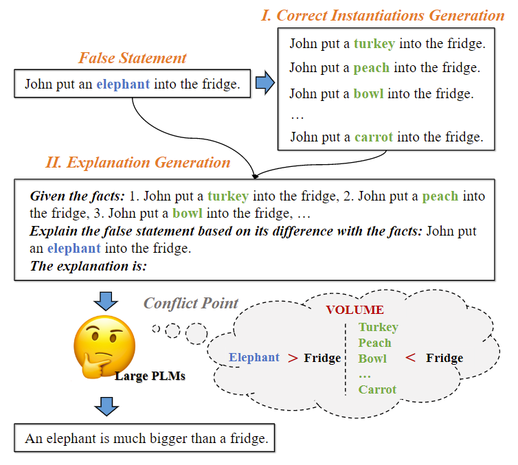

#  Neon
Official Codebase for [*Unsupervised Explanation Generation via Correct Instantiations*](https://arxiv.org/abs/2211.11160).

Please feel free to contact us with any questions or advices: `sjcheng20@fudan.edu.cn`.

## Framework
In this paper, We propose a two-phase framework **NEON** to help large PLMs generate explanations by implicitly identifying conflict points in the statement.

<p align = "center">

</p>
<p align = "center">
Figure 1: The framework of Neon.
</p>

## Main Results
<p align = "center">

</p>
<p align = "center">
Table 1: Automatic evaluation results.
</p>

<p align = "center">

</p>
<p align = "center">
Table 2: Human evaluation results.
</p>

## Dependencies
The code is mainly based on PyTorch and Huggingface `transformers`.

- Python==3.9.10
- pytorch==1.10.2
- transformers==4.21.0

## Datasets
Our main datasets are [ComVE](https://github.com/wangcunxiang/SemEval2020-Task4-Commonsense-Validation-and-Explanation) and [e-SNLI](https://huggingface.co/datasets/esnli). You need to download them and put them under the `data` folder. The detailed structure of files can be found in `data/ComVE/README.md` and `data/e-SNLI/README.md`, respectively.

In some sections, we conduct simple strategies to process our datasets, such as filtering and shuffling. These scripts are omitted, but you can easily reproduce them by yourself.

## Main Experiments
### Phase1
Conduct in-context learning in the phase I:
```
cd ./Phase1/in_context/
sh run_phase1.sh
```

Conduct CGMH (unsupervised method) in the phase I:
```
cd ./Phase1/CGMH/
sh run.sh
```

### Phase2
```
cd ./Phase2/
sh run_phase2.sh
```

### Evaluation
```
cd ./Evaluation/
sh run_eval.sh
```

## Analysis
We put the python-script `XXX.py` and its corresponding sh-script `XXX.sh` in the `XXX` section. You can directly run the `XXX.sh` for each analysis experiment to validate. We take the first analysis experiment *Quality* as an example:
```
cd ./Analysis/Quality/
sh run_binary.sh
```

## Citations
Please add this citation if our paper or code helps you :)

```
@article{cheng2022unsupervised,
  title={Unsupervised Explanation Generation via Correct Instantiations},
  author={Cheng, Sijie and Wu, Zhiyong and Chen, Jiangjie and Li, Zhixing and Liu, Yang and Kong, Lingpeng},
  journal={arXiv preprint arXiv:2211.11160},
  year={2022}
}
```